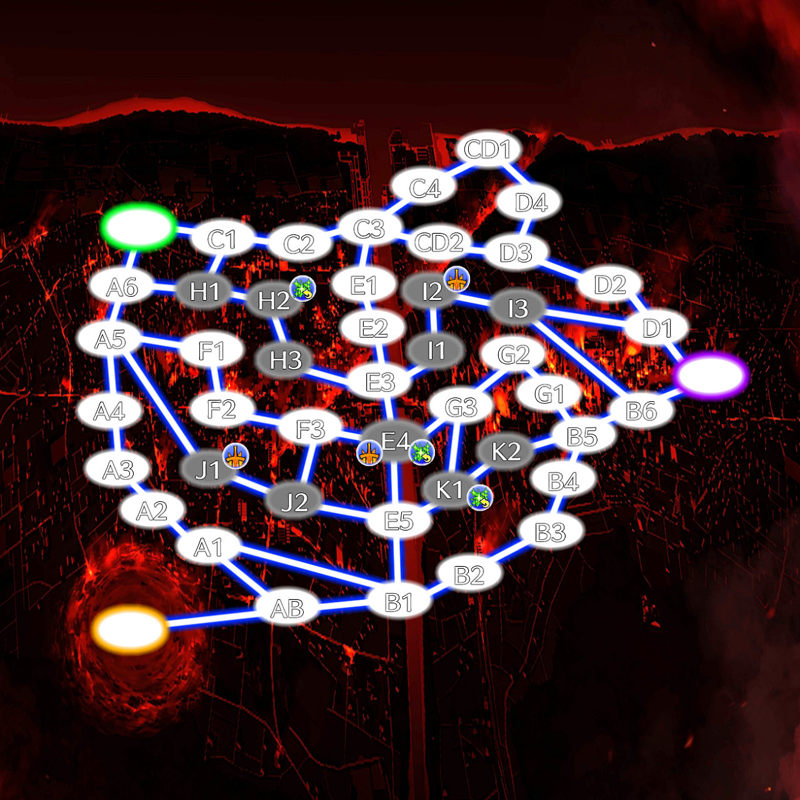
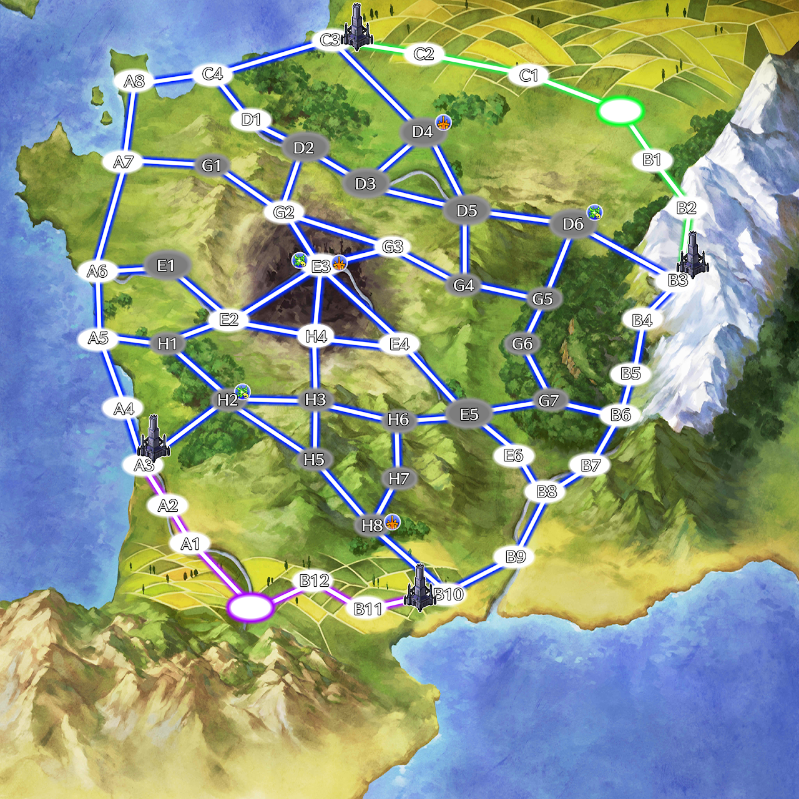
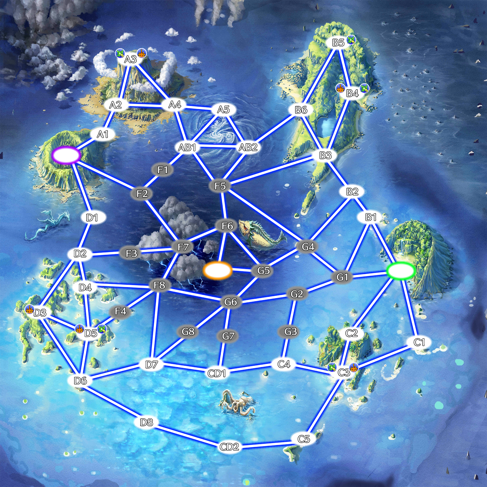
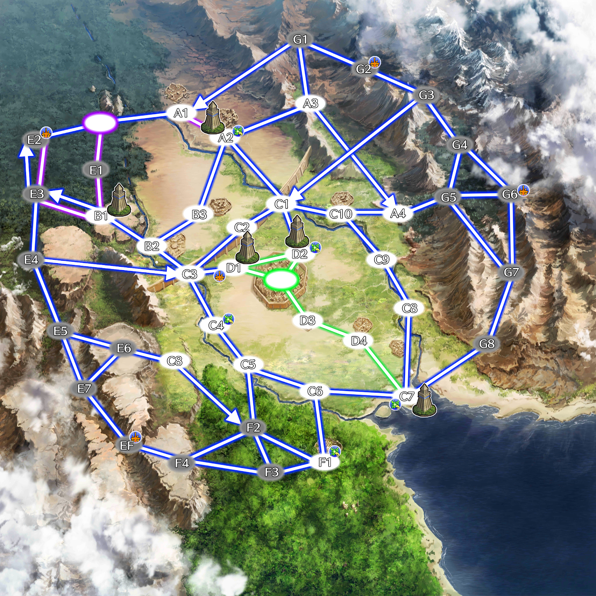
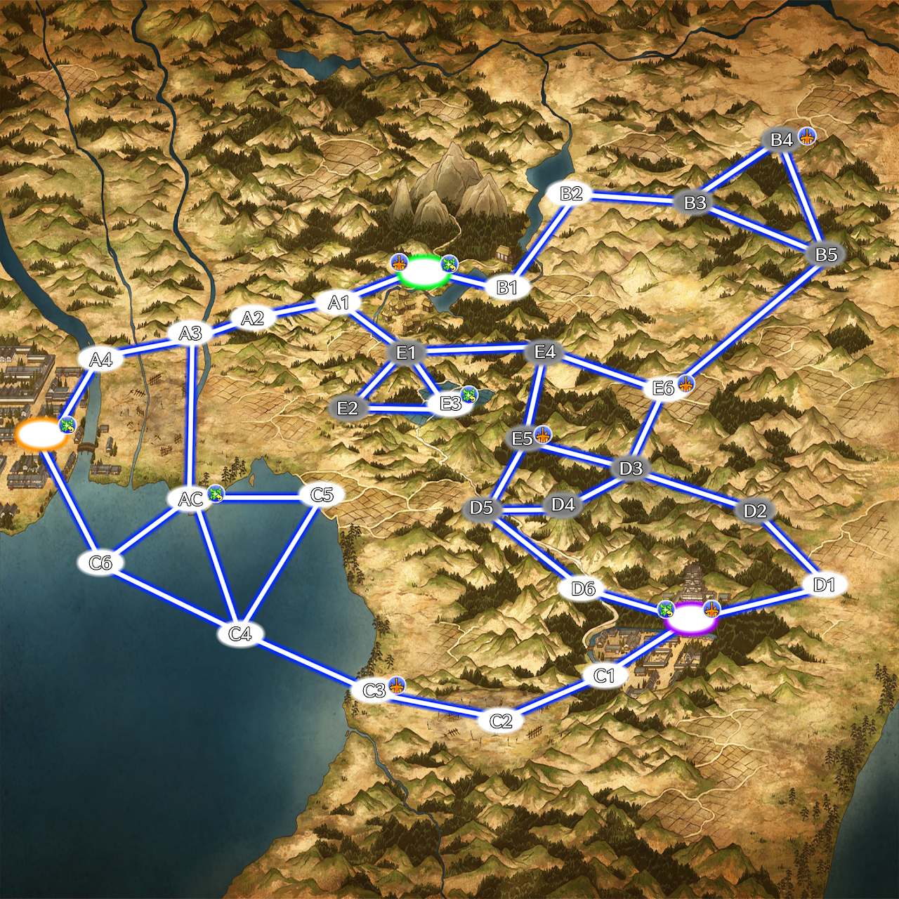
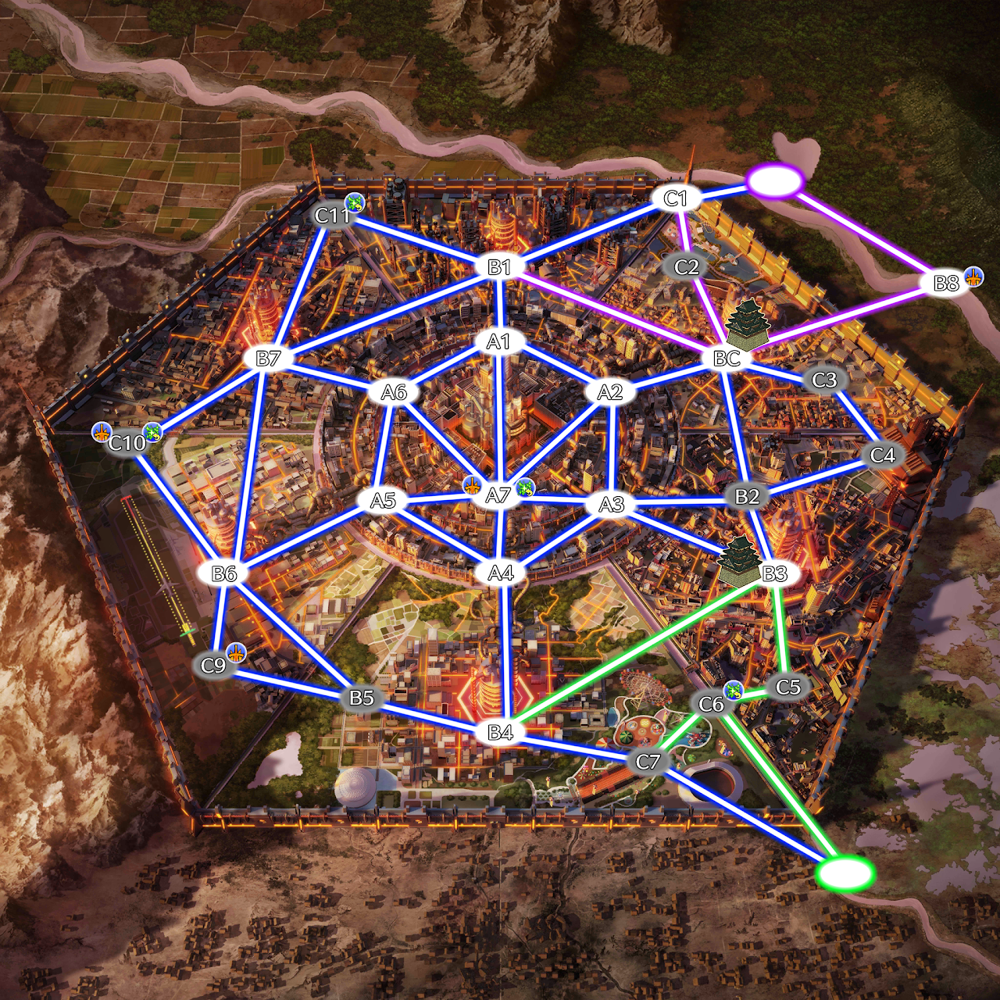

# 目錄
- [勝利條件](#勝利條件)
- [地圖物件說明](#地圖物件說明)
- [地圖１－廢墟都市](#地圖１廢墟都市)
- [地圖２－中世紀法國](#地圖２中世紀法國)
- [地圖３－海島地區](#地圖３海島地區)
- [地圖４－巴比倫古城](#地圖４巴比倫古城)
- [地圖５－古日本](#地圖５古日本)
- [地圖６－六角都市](#地圖６六角都市)
- [地圖行動](#地圖行動)
    - [移動](#移動)
    - [換位](#換位)
    - [進攻](#進攻)
    - [佔領](#佔領)
    - [使用靈地](#使用靈地)
    - [破壞](#破壞)
    - [建造陣地](#建造陣地)
    - [製作道具](#製作道具)
    - [修復](#修復)
    - [回歸](#回歸)
    - [能力發動](#能力發動)
    - [搶奪（僅限搶奪模式）](#搶奪僅限搶奪模式)
    - [交接（僅限搶奪模式）](#交接僅限搶奪模式)
- [御主的額外補正](#御主的額外補正)
- [前鋒規則](#前鋒規則)
- [先手與後手](#先手與後手)
- [「對策完畢」狀態](#對策完畢狀態)
- [戰鬥內容修改](#戰鬥內容修改)

# 勝利條件

1. 敵方全滅。
2. 破壞／搶奪指定物品（視乎地圖決定）。
3. 經過一定時間後，以場上的靈地佔領量決定。較高的一方獲勝。

# 地圖物件說明

    - 綠圈：綠色組別的據點。在【搶奪】模式下，敵隊無法進入。
    - 紫圈：紫色組別的據點。在【搶奪】模式下，敵隊無法進入。
    - 橘圈：【搶奪目標】的所在地。
    - 白色：一般區域。所有白色格子存在的單位都是公開情報。
    - 灰色：迷霧區域。進入後的移動必須與ＧＭ私訊告知，並且只有位於區域周邊的狀況下，才能知道區域內存在的單位。
    - 恢復圖標：恢復的靈地。佔領該區域的陣營，可以在該區域使用靈地功能恢復ＨＰ與疲勞。
    - 蓄能圖標：龍脈的靈地。佔領該區域的陣營，可以在該區域使用靈地功能恢復ＭＰ。
    - 塔型圖標：防禦塔。其損傷上限為２００。對其進行【破壞】時，若攻擊後依然存在，攻擊者會受到4d6的傷害（無視減傷‧無法反應）。

    - 藍色路徑：一般，所有人皆可通行。
    - 箭頭路徑：單行道，只能往箭頭所指方向通行。
    - 隊伍路徑：與隊伍顏色相同，沒有擊破該段路線防禦塔的場合，敵隊無法通行。
    路徑的效果是可以疊加的。

靈地的每回合恢復在無所屬的狀態下雙方皆可享有，遭到佔領的場合只有佔領方享有戰鬥中恢復效果。

任何一個區域皆可同時存在一名以上的同陣營單位。

【破壞】模式下的目標（核心），默認處於各組別的據點，其損傷上限為５００。

# 地圖１－廢墟都市

地圖類型：搶奪

陷入了大火之中的廢墟城市，許多地方都充滿著戰爭的跡象。

恢復靈地（Ｈ２）：開局即視為綠色組別佔領。佔領需求５０。恢復量：５０ＨＰ＆２疲勞（使用）／１０ＨＰ（戰鬥中每回合）

恢復靈地（Ｋ１）：開局即視為紫色組別佔領。佔領需求５０。恢復量：５０ＨＰ＆２疲勞（使用）／１０ＨＰ（戰鬥中每回合）

魔力靈地（Ｊ１）：開局即視為綠色組別佔領。佔領需求５０。恢復量：５０ＭＰ＆２疲勞（使用）／１０ＭＰ（戰鬥中每回合）

魔力靈地（Ｉ１）：開局即視為紫色組別佔領。佔領需求５０。恢復量：５０ＭＰ＆２疲勞（使用）／１０ＭＰ（戰鬥中每回合）

恢復與魔力靈地（Ｅ４）：佔領需求１００。恢復量：３５ＨＰ＆３５ＭＰ＆２疲勞（使用）／５ＨＰ＆５ＭＰ（戰鬥中每回合）

# 地圖２－中世紀法國

地圖類型：破壞

鄰近地中海的法國，山脈與森林眾多。

恢復靈地（Ｄ４）：佔領需求３０。恢復量：３０ＨＰ＆３疲勞（使用）／５ＨＰ（戰鬥中每回合）

恢復靈地（Ｈ２）：佔領需求３０。恢復量：３０ＨＰ＆３疲勞（使用）／５ＨＰ（戰鬥中每回合）

魔力靈地（Ｄ６）：佔領需求３０。恢復量：４０ＭＰ（使用）／１０ＭＰ（戰鬥中每回合）

魔力靈地（Ｈ８）：佔領需求３０。恢復量：４０ＭＰ（使用）／１０ＭＰ（戰鬥中每回合）

恢復與魔力靈地（Ｅ３）：佔領需求８０。恢復量：２０ＨＰ＆３０ＭＰ＆２疲勞（使用）／５ＨＰ＆５ＭＰ（戰鬥中每回合）

# 地圖３－海島地區

地圖類型：搶奪

未知的廣闊海域，需要在各島之間移動作戰。

恢復靈地（Ｂ５）：佔領需求８０。恢復量：６０ＨＰ與５疲勞（使用）／１０ＨＰ（戰鬥中每回合）

魔力靈地（Ｄ３）：佔領需求８０。恢復量：１００ＭＰ（使用）／１０ＭＰ（戰鬥中每回合）

恢復與魔力靈地（Ａ３）：佔領需求３０。恢復量：２０ＨＰ＆２０ＭＰ＆２疲勞（使用）／５ＨＰ＆５ＭＰ（戰鬥中每回合）

恢復與魔力靈地（Ｂ４）：佔領需求３０。恢復量：２０ＨＰ＆２０ＭＰ＆２疲勞（使用）／５ＨＰ＆５ＭＰ（戰鬥中每回合）

恢復與魔力靈地（Ｃ３）：佔領需求３０。恢復量：２０ＨＰ＆２０ＭＰ＆２疲勞（使用）／５ＨＰ＆５ＭＰ（戰鬥中每回合）

恢復與魔力靈地（Ｄ５）：佔領需求３０。恢復量：２０ＨＰ＆２０ＭＰ＆２疲勞（使用）／５ＨＰ＆５ＭＰ（戰鬥中每回合）

# 地圖４－巴比倫古城

地圖類型：破壞

兩河流域內的古城群，受到山脈所包夾。儘管資源豐厚，卻容易遭到進攻。

恢復靈地（Ａ２）：佔領需求３０。恢復量：４０ＨＰ＆２疲勞（使用）／１０ＨＰ（戰鬥中每回合）

恢復靈地（Ｄ２）：佔領需求３０。恢復量：４０ＨＰ＆２疲勞（使用）／１０ＨＰ（戰鬥中每回合）

恢復靈地（Ｃ４）：佔領需求３０。恢復量：４０ＨＰ＆２疲勞（使用）／１０ＨＰ（戰鬥中每回合）

恢復靈地（Ｃ７）：佔領需求３０。恢復量：４０ＨＰ＆２疲勞（使用）／１０ＨＰ（戰鬥中每回合）

恢復靈地（Ｆ１）：佔領需求３０。恢復量：４０ＨＰ＆２疲勞（使用）／１０ＨＰ（戰鬥中每回合）

魔力靈地（Ｄ１）：佔領需求３０。恢復量：４０ＭＰ（使用）／１０ＭＰ（戰鬥中每回合）

魔力靈地（Ｅ２）：佔領需求３０。恢復量：４０ＭＰ（使用）／１０ＭＰ（戰鬥中每回合）

魔力靈地（ＥＦ）：佔領需求３０。恢復量：４０ＭＰ（使用）／１０ＭＰ（戰鬥中每回合）

魔力靈地（Ｇ２）：佔領需求３０。恢復量：４０ＭＰ（使用）／１０ＭＰ（戰鬥中每回合）

魔力靈地（Ｇ６）：佔領需求３０。恢復量：４０ＭＰ（使用）／１０ＭＰ（戰鬥中每回合）

# 地圖５－古日本

地圖類型：搶奪

群山之間的古代城鎮，陸路、水路與山區隔開的行動路線具有劇烈差異。

恢復與魔力靈地（綠色）：自動佔領。恢復量：３０ＨＰ＆３０ＭＰ＆１疲勞（使用）

恢復與魔力靈地（紫色）：自動佔領。恢復量：３０ＨＰ＆３０ＭＰ＆１疲勞（使用）

恢復靈地（橘圈）：佔領需求３０。恢復量：１０ＨＰ＆１疲勞（使用）／１０ＨＰ（戰鬥中每回合）

恢復靈地（Ｅ３）：佔領需求３０。恢復量：３０ＨＰ＆２疲勞（使用）／５ＨＰ（戰鬥中每回合）

恢復靈地（ＡＣ）：佔領需求３０。恢復量：４０ＨＰ＆３疲勞（使用）／１０ＨＰ（戰鬥中每回合）

魔力靈地（Ｃ３）：佔領需求３０。恢復量：３０ＭＰ（使用）／５ＨＰ（戰鬥中每回合）

魔力靈地（Ｅ５）：佔領需求３０。恢復量：４０ＭＰ（使用）／５ＭＰ（戰鬥中每回合）

魔力靈地（Ｅ６）：佔領需求３０。恢復量：４０ＭＰ（使用）／５ＭＰ（戰鬥中每回合）

魔力靈地（Ｂ４）：佔領需求３０。恢復量：８０ＭＰ（使用）／１０ＭＰ（戰鬥中每回合）

# 地圖６－六角都市

地圖類型：破壞

坐落於平原的大型要塞都市，能夠隱蔽與利用的區域相當稀少。

恢復靈地（Ｃ６）：佔領需求３０。恢復量：３０ＨＰ＆２疲勞（使用）／１０ＨＰ（戰鬥中每回合）

恢復靈地（Ｃ１１）：佔領需求５０。恢復量：５０ＨＰ＆３疲勞（使用）／１０ＭＰ（戰鬥中每回合）

魔力靈地（Ｂ８）：佔領需求３０。恢復量：４０ＭＰ（使用）／１０ＨＰ（戰鬥中每回合）

魔力靈地（Ｃ９）：佔領需求５０。恢復量：５０ＭＰ（使用）／１０ＭＰ（戰鬥中每回合）

恢復與魔力靈地（Ａ７）：佔領需求５０。恢復量：３０ＨＰ＆３０ＭＰ＆２疲勞（使用）

恢復與魔力靈地（Ｃ１０）：佔領需求８０。恢復量：３０ＨＰ＆３０ＭＰ＆２疲勞（使用）

# 地圖行動

敏捷與耐力每等級會提供各５點的「行動力」。

雙方告知完行動之後，才會結算其行動結果。

進入戰鬥時，有２０％機率進入隱藏地圖（暗骰），否則會在三張戰鬥地圖之中隨機選一進行。

在某些特定地點，必定會進入隱藏地圖。

## 移動

以１０為單位支付行動力，依照預定的路線進行移動。

若是移動中途或結束時與敵方處於同一格，視為進入戰鬥，並中斷原本的移動。

戰鬥中，自己的回合開始時可以宣言撤退，並於下一回合開始時離開戰場。

戰場上只剩下其中一方時，由該陣營留在該格。撤退的一方需要留在原本的格子。

在自己組別的起點發起戰鬥時，可以任意決定起始位置。在【破壞】模式下，原本的起始位置變為核心所在處，無法移動至該格。

## 換位

支付５行動力，若周邊格子存在友軍，與其交換位置（雙方同時支付）。

這個交換在發起戰鬥的時候會被無效。

## 進攻

支付５行動力，往已知存在敵方單位的格子移動並且進入戰鬥。

戰鬥中，自己的回合開始時可以宣言撤退，並於下一回合開始時離開戰場。撤退無法反悔，同陣營的單位撤退將分開結算。

戰場上只剩下進攻者時，由進攻者留在該格。原先佔據者撤退的場合，需要後撤一格。

當雙方同時進攻彼此時，行動力上限較高的單位可以自由決定待在哪一格。

當同一陣營的單位在不同的格子上對同一格的敵方發起進攻時，進攻方向越多，則撤退的難度越高。每多一條進攻方向，對方要撤退的回合花費將提升一回合。

## 佔領

以１０為單位支付行動力，對靈地進行佔領。

當靈地的佔領進度累積到滿足需求時，視為持有該靈地。

當靈地存在敵方的佔領進度，必須先抵銷至０才能開始累積自陣營的佔領進度。

已經被完全佔領的靈地，直到佔領進度被抵銷至０以前，都仍可由已佔領的一方使用。

若是在佔領的時候發起戰鬥，此行動的效益只有一半。

## 使用靈地

支付１０行動力，使用靈地的功能。一個行動回合最多一次。

在靈地上恢復的數值將依照各地圖的狀況決定。

若是在使用靈地的時候發起戰鬥，此行動會被打斷。

## 破壞

支付１０行動力，對陣地或是特定地圖物件進行破壞。

每次破壞皆可任意使用一種傷害型能力進行。

不過部分場合需要額外支付行動力。

    戰技：

    １～３級／額外支付５行動力。

    ４～６級／額外支付１０行動力。

    ７～９級／額外支付１５行動力。

    需要詠唱的能力：

    １～６ＡＰ／額外支付５行動力。

    ７～１２ＡＰ／額外支付１０行動力。

    １３～１８ＡＰ／額外支付１５行動力。

    １９ＡＰ以上／額外支付２０行動力。

## 建造陣地

此處的陣地包含神殿與工房。

每消耗５行動力，可以累積２等級的製作進度（可以連續投入來提升等級）。

進度與等級相等時，在所處的格子上建造陣地。

已經建造了陣地的格子上，無法再建造陣地。

## 製作道具

每消耗５行動力，可以製作２等級的道具（可以連續投入來提升等級）。

一次製作複數個道具的場合，第二個開始，每個道具需要額外支付５行動力（可疊加）。

## 修復

消耗５行動力，將身上所有【攻擊手法】對應的武器修復到完全狀態。

除此之外也可以對實體寶具、魔術禮裝、教會武裝、道具等物品進行修復，支付等同發動消耗／製作消耗一半的ＭＰ即可修復到完全狀態。

被動寶具則需要支付【等級×５】點的ＭＰ修復（最低為１０）。

## 回歸

將該移動回合內的所有行動力支付，在結算後回到隊伍起始點。

遭到進攻的場合會被打斷。

## 能力發動

消耗１０行動力與能力本身的消耗，發動自己持有的一項非直接傷害型能力。

該回合若無進入戰鬥，則下回合才開始計算該能力帶來的狀態更新。

如果該能力需要詠唱，則每３ＡＰ的需求要額外消耗１０行動力（持有咒語元素的影響時，只消耗５行動力）。

作用範圍僅限自身所處的該格。

## 搶奪（僅限搶奪模式）

以１０為單位支付行動力，對目標物進行搶奪。

當搶奪的進度累積到１００點時，視為得到該目標物，其後，必須移動回到陣營據點才視為獲勝。

當多方進行搶奪的場合，會發生戰鬥。

得到搶奪的目標物時，其位置為強制公開（即便處於迷霧區域）。

此後，不論其行動力，皆只能進行從【交接】或是一格【移動】中擇一進行。

持有目標物的單位陣亡時，目標物會在原地掉落。

## 交接（僅限搶奪模式）

將所有行動力支付，將目標物交予存在於同一格的隊友。

拿到目標物的單位當回合不可以進行任何行動（此規定會溯及既往）。

# 御主的額外補正

基礎具有以下補正。

    在判定藉機攻擊時，有效傷害的判定門檻＋５。

    骰數全數增加１顆。

    最大ＭＰ＋１０。

    移動上限＋１。

    ＡＰ＋１。

    持有神秘。

    所有因為御主之身分而與從者有所差距的判定基準（如跳躍、拋擲等）皆以從者的數值為判定標準。

依照適性等級，可以得到以下強化（累計）。

    Ｅ／無。

    Ｄ／骰數全數增加１顆。

    Ｃ／最大ＭＰ＋１０。在判定藉機攻擊時，有效傷害的判定門檻＋５。

    Ｂ／能力ＭＰ消耗全數下降５點。

    Ａ／額外增加一次復活額度。

    ＋號／受到的負面狀態視為降低一級（被降到Ｅ等級以下的場合，無效化）。

# 前鋒規則

選角結束後，雙方隊伍可以各自選擇一名成員作為「前鋒」。此為公開資訊。

前鋒的行動力將提升50%，並且在戰鬥時每滿足一項條件就能選擇一項增益效果。

條件：

- 敵方的前鋒在場。
- 我方人數小於敵方人數。遭到進攻的場合，人數相等也視為滿足。
- 搶奪模式下，自身持有搶奪目標。
- 破壞模式下，處於我方或敵方的據點。

可選效果：

- 進行戰鬥行動與視為戰鬥行動的戰技時，擲骰數＋１。
- 選擇一項能力，其消耗減免一半，但不會再受其他減免效果影響。
- 獲得一項Ｃ級職階能力／獲得兩項Ｄ級職階能力。已經持有選擇的職階能力時，改為使該職階能力上升一級（Ａ級則無法提升），且該上升不會改變加號或減號帶來的效果。

# 先手與後手

戰鬥開始時，根據戰鬥狀況，會有一定的流程進行【先手】與【後手】的區分。

【先手】：第一回合時，非反應時造成的傷害下降５０％。

【後手】：第一回合時，所有【攻擊】與其衍生行動的ＡＰ消耗皆為兩倍。

設兩方的參戰人數分別為Ｘ跟Ｙ。

如果Ｘ少於Ｙ：

- Ｙ的組別最多只有一個人算為先手。
- 該場戰鬥中，行動次序前半的作為先手，後半的作為後手。
- 人數是奇數的場合，居中的視為先手。

如果雙方人數相等：

- 假設行動次序前半的人數中，Ｘ佔較多，則Ｘ的組別之後手人數不得少於先手人數。
- 該場戰鬥中，行動次序前半的作為先手，後半的作為後手。
- 人數是奇數的場合，居中的視為先手。

# 「對策完畢」狀態

藉由看破系的元素，可以在戰鬥中發揮特殊的效果。

一場戰鬥中，將依照此狀態的等級得到數量不等的【對策點】。

持有不同等級的【對策完畢】時，以最高等級的為基準。

Ｅ～Ａ級為每等級２點，ＥＸ級為１６點。

對策點可以在「與對象發生反應時」用作以下用途。

- 每消耗１點可在反應中無視對方５點防禦量（１次‧效果量可疊加）。
- 每消耗１點可在反應中無視對方５點傷害閾值（１次‧效果量可疊加）。
- 消耗３點，反應結束後隨機解除一個對方賦予的效果。
- 消耗５點，能在對方反應後將自己的戰鬥行動修改成其他類型，且對方無法更改反應。

# 戰鬥內容修改

戰鬥中默認無法刻意觸發其他角色的弱點。

所有角色陣亡後會於基地復活，最多兩次。

復活後會解除身上所有狀態，ＨＰ、ＭＰ、疲勞、破損度皆完全恢復。

部份等級之對魔力的傷害減免遭到削減。

    Ｂ／減免量－３，＋號只給予２倍的額外減傷。

    Ａ／減免量－５，＋號只給予３倍的額外減傷。

    ＥＸ／減免量－１０。

範圍攻擊：

    對同級（含）以下工房、陣地、神殿、對陣寶具造成的破損度為兩倍。

御主禮裝：

    迴路改良→指定一個單位每回合恢復１０ＭＰ（３回合）。

    機能：知覺共享→指定一個單位，彼此可以無視距離，互通所有偵察、感知效果（負面干涉不作用）。

    機能：決戰術式→開戰時指定一個友方單位，提升２０點ＨＰ上限＆提升２０點ＭＰ上限＆造成的傷害值提升５點＆防禦力上升５點＆造成的寶具傷害值上升１０點（無法疊加）。這個效果在復活後解除。

御主特質：

    高速思考：

    回合結束時，秘密地指定任意一個在該場戰鬥內曾經察覺過的單位並向ＧＭ宣言其一項行動。
    直到下一回合前，若對方藉由該行動在自己的偵察‧感知範圍內執行了宣言的動作或是在該範圍內即將造成影響，自身可以無條件進入反應時間（優先於對方的行動判定）。
    在該反應時間內，自身可以執行最多１／２／３／３／４（依等級改變）ＡＰ的行動，這段期間無法被目標反應。
    反之，對方沒有做出那個行動的場合，下一回合會損失３／３／３／２／２（依等級改變）ＡＰ。

    可以宣言的行動：任意一種戰鬥行動（除警戒、觀望）／一種類型的能力發動／詠唱／藉機攻擊。

元素：

    使魔系：

    可以在地圖上利用【能力發動】做召喚，默認跟隨召喚者，行動階段開始時可以任意停止跟隨。
    該使魔要進行【地圖行動】的話，只能使用召喚者的行動力。
    當進入只存在使魔的格子時，若該使魔屬於敵方陣營，可以選擇被所有使魔攻擊一次，將該格子的所有使魔消滅。

    巧手：
    可以在戰線開始時製作相同等級數的道具。

    解析：

    持有此狀態的場合，與敵方單位發動戰鬥時，自動發動一次等同該元素機率的判定。
    成功的場合可以視為知道對方的弱點，能夠主動觸發，並得到與元素等級相同的【對策完畢】狀態。
    重複持有時，僅取最高級計算。

    鑑明＆睿智：
    根據元素的等級，每與敵方單位進行一定次數的戰鬥，將會累積一定程度的【對策完畢】。
    重複持有時，僅取最高級計算。

    Ｃ／I級：每兩場累積一級。
    Ｂ／II級：每一場累積一級。
    Ａ／III級：每一場累積二級。

    朦朧＆欺瞞：
    可以抵擋對應等級（含）以下的解析、鑑明、睿智效果。
    重複持有時，僅取最高級計算。

    遺忘：
    與持有該效果的單位交戰時，在其等級之下的【復仇者】、【忘卻補正】不會作用。

主動御主禮裝的冷卻時間全數增加一回合。

【防守】、【瓦解】不適用物理防禦效果量翻倍。

無法使用【令咒】、【幻想崩壞】、【羈絆技能】、【羈絆行動】。

【強制解放】只能在免除消耗的次數內使用，不會隨復活補充。

持有氣息遮斷的場合，只有於迷霧區域【進攻】或進入戰鬥才發動。

使魔或坐騎等召喚型單位，無法在地圖上進行召喚。

【單獨行動】唯有獨立作戰的時候才能發動。

部分【狂化】的加號效果之「御主不在場時發動的效果」於獨立作戰時發動。

因副作用而導致角色永久無法繼續行動且並非致死的能力，在施放的戰鬥結束後以陣亡處理。

藉由幸運或被動能力得到的重骰額度以整場戰線共同計算。

持有【稀世之才】的御主其魔力素質被視為Ａ級，且變為ＥＸ級的特質所帶來的影響必須下調為Ａ級。

狀態將在地圖移動上也保留，並在每輪開始時計算效果觸發、每輪結算時更新持續時間。

地圖移動結算時，角色能力的冷卻時間也更新一回合。